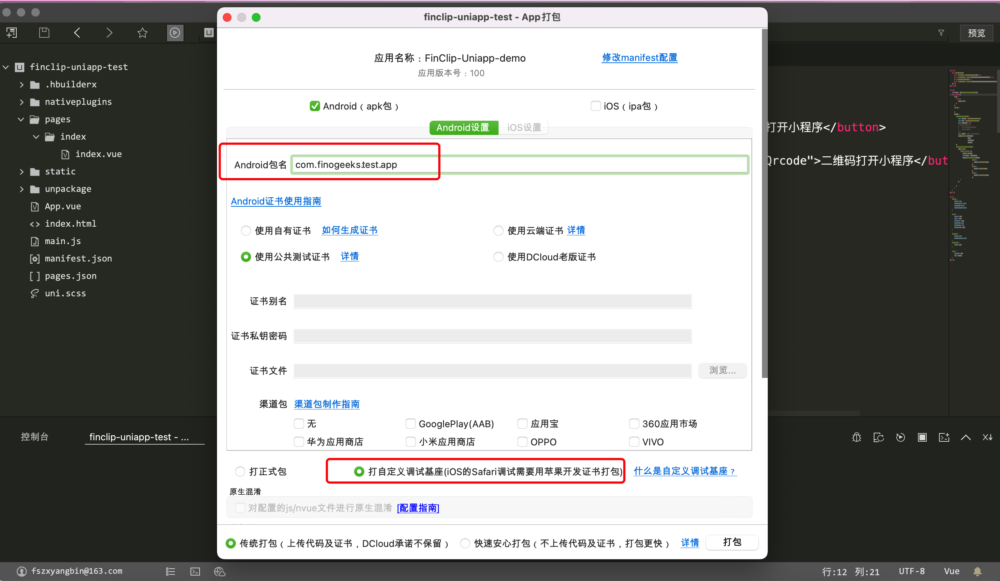

# FinClip-Uniapp-demo

#### 介绍
FinClip SDK 凡泰Uniapp插件，利用Uniapp[插件功能](https://nativesupport.dcloud.net.cn/NativePlugin/course/android),集成FinClip SDK，实现小程序。

 

#### 软件架构


#### 使用说明
（注本项目资源使用HBuilderX 3.4.7.20220422开发，只集成了FinClip 核心SDK,如需要更多功能，可使用安卓/IOS原工程重新生成插件）

1.  引入已经生成好的插件

2.  选择插件


3.  生成自定度基座方便项目调试 （以安卓为例，注意包名需要和下方获取SDKKey和Secret的包名一致）





4. 在Uniapp项目中初始FinClip SDK

   获取 [SDK KEY 及 SDK SECRET](https://www.finclip.com/mop/document/introduce/accessGuide/enterprise-guidelines.html#_6-%E5%85%B3%E8%81%94%E7%A7%BB%E5%8A%A8%E5%BA%94%E7%94%A8)

```JavaScript

    const MopSdk = uni.requireNativePlugin('MopSdk');

	export default {
		onLaunch: function() {
            MopSdk.initialize({
                                'sdkKey': '22LyZEib0gLTQdU3MUauAa2CctUv+NxTLFWyPxC28y2gA4x+JWh7hhNS5aO52BFs',
                                'sdkSecret': '65146ffa924ecfdc',
                                'apmServer': 'https://api.finclip.com'
                             },
                             (ret) => {
                                 console.log('App Launch Success', ret)
                             },
                             (ret) =>{
                                 console.log('App Launch Fail', ret)
                             });
        }
    }
    
```

5. 在Uniapp项目中打开小程序

```JavaScript

<template>
	<view class="content">
		<image class="logo" src="/static/logo.png"></image>
		<button type="primary" v-on:click="handleOpenMiniProgram">打开小程序</button>
		<view class="padding-gap"></view>
		<button type="primary" v-on:click="handleOpenMiniProgramByQrcode">二维码打开小程序</button>
	</view>
</template>

<script>
	const MopSdk = uni.requireNativePlugin('MopSdk');
	export default {
		data() {
			return {
				title: 'Hello'
			}
		},
		onLoad() {

		},
		methods: {
			handleOpenMiniProgram() {
				const apiServer = 'https://api.finclip.com'
				const appId = '5eec56a41464cc0001852e9a'
				const startParams = null
				// const startParams = {
				// 	path: '/pages/index/index',
				// 	query: 'a=1&b=2'
				// }
				const sequence = null // 小程序的上架序列号
				MopSdk.openApplet(apiServer,
				                  appId,
								  startParams,
								  sequence)
			},
			handleOpenMiniProgramByQrcode() {
				uni.scanCode({
					success: (result) => {
						console.log(result)
						const qrcode = result.result
						MopSdk.openAppletByQrcode(qrcode,
						                  (ret) => {
											  console.log('onSuccess',ret)	
										  },
										  (ret) => {
											  console.log('onFail',ret)	
										  },
										  (ret) => {
										  	console.log('onProcess',ret)								  
										  })
					}
				})
				
			}
		}
	}
</script>


```

#### 插件API

#### 插件拓展

#### 存在问题
1、能实现Uniapp界面打开小程序再打开Uniapp界面？
答：存在页面栈问题，由于Uniapp使用的自己的页面栈，导致在小程序界面打开Uniapp的页面层级不同，解决方案是打开时调用关闭小程序方法，效果不是很好，产品设计尽量避开这种设计。


